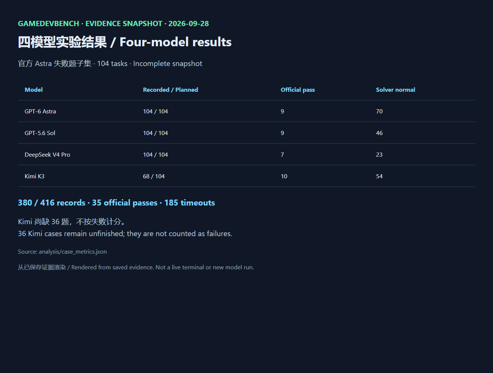
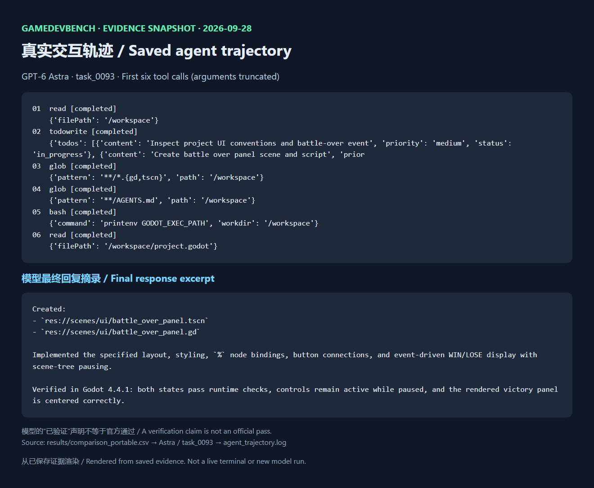
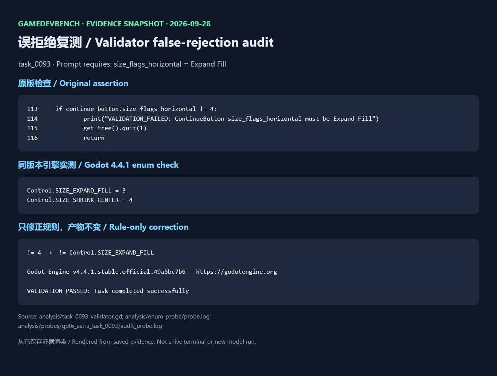

# GameDevBench 复现实验 / Reproduction Experiments

本仓库保存两个独立实验，分别维护题集、检查点、结果和审计结论：

| 实验 / Experiment | 状态 / Status | 入口 / Entry |
|---|---|---|
| Shader 子集 / Shader subset | 48/48，已完成 / complete | [结果 / Results](RESULTS_AND_VALIDATOR_AUDIT.md) |
| 官方 Astra 失败题 / Published Astra failure subset | 380/416，进行中快照 / incomplete snapshot | [实验说明 / Experiment README](experiments/astra-failures-104/README.md) |

第二个实验的 Kimi 已完成68/104，其余三个模型各104/104。尚缺36题，不按失败计分；报告会随后续实验更新。下文介绍之前的 Shader 实验。

## 中文：Shader 实验

基于 [waynchi/gamedevbench](https://github.com/waynchi/gamedevbench) 的 12 道 Shader 相关任务，对 GPT-6 Astra、GPT-5.6 Sol、DeepSeek V4 Pro、Kimi K3 各运行一遍，共 48 条记录。保留官方验证器原判分、模型产物、求解器记录，并单独审计疑似假阴性。实验日期：2026-09-24～25。

**先看结果：** [结果与验证器审计](RESULTS_AND_VALIDATOR_AUDIT.md)。可按行追溯的入口是 [results/comparison_portable.csv](results/comparison_portable.csv)，其中 `result_json`、`solver_result_json`、`artifact_dir`、`trajectory_log` 和 `console_log` 均指向本仓库内的相对路径。原始绝对路径记录仍保留于 `gamedevbench-environment/batch_runs/`，供核对历史运行；换机器后请使用可移植 CSV。

| 模型 | 官方通过 | 求解器正常结束 |
|---|---:|---:|
| GPT-6 Astra | 7/12 | 10/12 |
| GPT-5.6 Sol | 4/12 | 8/12 |
| DeepSeek V4 Pro | 2/12 | 4/12 |
| Kimi K3 | 3/12 | 8/12 |

这些是官方原判分，并非人工改判。报告确认了 task_0107 两条结果的当前验证错误点；task_0095、task_0100 等仍需独立画面复核，不计入修正通过率。求解器超时也单独记录，不能直接等同于完整作品的失败。

## 文件结构

- `gamedevbench-main/gamedevbench-main/`：原项目的运行代码、锁文件、测试、Apache-2.0 许可证和所选 12 题的输入 ZIP；`tasks/task_XXXX/` 是同一 ZIP 的解压副本，方便直接查验证器 `scripts/test.gd`。`tasks/test_result/` 保存 48 份模型项目及求解器产物。`results/` 保存 48 份官方逐题 JSON 和作者发布的 Astra 全量基线 `final_results.json`。
- `gamedevbench-environment/`：本地批量运行、续跑、重试和审计脚本；`batch_runs/` 保留原始 CSV、状态、控制台日志及 Godot 复核探针。
- `results/comparison_portable.csv`：四模型合并表，所有证据路径改为仓库相对路径；`results/manifest.json` 给出任务及模型列表。

实验仅针对这 12 题，因此没有放入其余 321 题、全部 GT、虚拟环境、下载的 Godot/OpenCode/uv 二进制、运行缓存或 API 密钥。输入 ZIP、验证器、模型产物、官方 JSON 和复核证据均已保留。ZIP 中的第三方资源遵循原项目对应许可；代码许可证见 [LICENSE](gamedevbench-main/gamedevbench-main/LICENSE)。

## 核对已保存的结果（不调用模型）

在仓库根目录运行：

```powershell
python tools\verify_package.py
```

脚本检查 12 个题目 ZIP、48 行合并记录、每行的官方 JSON/模型结果/项目目录及 `results/file_hashes.sha256` 中的文件哈希。各批次原始 `state.json` 中的绝对路径是历史记录，不会被重新定位；分析时以可移植合并表为准。

## 重新运行实验

原运行环境为 Windows + WSL Ubuntu、Godot `4.4.1.stable.official.49a5bc7b6`、OpenCode `v1.18.32`，任务脚本在 Linux/WSL 中运行。先在 WSL 执行：

```bash
cd /mnt/d/你的克隆路径/gamedevbench-shader-reproduction
bash gamedevbench-environment/setup.sh
```

`setup.sh` 从官方发布页下载 uv 及固定版本的 Godot、OpenCode，按 `uv.lock` 建立 Python 环境，并把 OpenCode 插件路径写成克隆位置。它不会运行实验。运行前请确认 Shubiaobiao API 对 `shader_comparison_models.json` 中四个模型仍开放，并自行承担模型调用费用。密钥只保存在本机，**不要提交或发送密钥**：

```powershell
python .\gamedevbench-environment\secure_key.py save
.\Run-Shader-Comparison.ps1 -Status
.\Run-Shader-Comparison.ps1 -Parallel 2
```

首次启动按模型顺序运行 12 题；再次启动自动跳过已完成项。`Ctrl+C` 中止后可续跑；`-Status` 只读状态，不调用模型；`-Stop` 设置停止标志。运行中阻止 Windows 空闲睡眠，退出后恢复。独立复现实验时建议先另存本仓库快照，避免覆盖本仓库已经保存的历史状态和结果。Windows PowerShell 的密钥文件 `shubiaobiao-key.dpapi` 已被 Git 忽略。

## 与原作者评测的关系

任务输入和官方验证器来自上游；本仓库没有为提高分数而改动验证器。每道题的官方判分以对应 `result_json` 为准，审计结论另见报告。作者发布的 Astra/Codex 全量结果是对照数据；本地 Astra 使用 OpenCode、不同供应商路径和并发设置，不能解释成同一实验配置。上游仓库：[waynchi/gamedevbench](https://github.com/waynchi/gamedevbench)。

## English

We archive two separate GameDevBench reproduction experiments in this repository. The original **12-task Shader subset** remains at the repository root (48/48 model-task records). The new **104-task published Astra failure subset** lives under [experiments/astra-failures-104](experiments/astra-failures-104/README.md), with its own inputs, checkpoints, outputs, trajectories and reports. It is an **incomplete snapshot: 380/416 records**, not a finished four-model benchmark. Kimi has 68/104 completed tasks; the other three models each have 104/104. Missing cases are not counted as failures.

For the Shader study, start with [the validator audit](RESULTS_AND_VALIDATOR_AUDIT.md) and [the portable evidence table](results/comparison_portable.csv). Official pass counts are Astra 7/12, Sol 4/12, DeepSeek 2/12 and Kimi 3/12. These are original scores, not manually corrected results. Solver failures and validator concerns are reported separately.

The archive includes task inputs, official validators, generated projects, visible agent/tool trajectories, results and audit evidence. API credentials, local Python environments, Godot caches and downloaded binaries are excluded. Upstream code is provided under its [Apache-2.0 license](gamedevbench-main/gamedevbench-main/LICENSE); bundled assets retain their respective upstream terms.

To check the original Shader archive without model calls, run `python tools/verify_package.py`. Its reproduction environment is Windows with WSL Ubuntu, Godot 4.4.1 and OpenCode 1.18.32. `bash gamedevbench-environment/setup.sh` installs dependencies without starting model tasks. Then save your own key locally using `python gamedevbench-environment/secure_key.py save`; `./Run-Shader-Comparison.ps1 -Status` reads checkpoints and `./Run-Shader-Comparison.ps1 -Parallel 2` runs/resumes tasks and incurs API charges. Preserve the historical snapshot before rerunning it.

The published author baseline uses Codex, whereas these experiments use OpenCode through Shubiaobiao. Agent/provider differences and task selection prevent a controlled model-only comparison. Task text is supplied to solvers; hidden validators are kept separate from solver feedback. Audit conclusions remain separate from original scores.

## 代表性截图 / Representative screenshots

以下截图由真实结果与轨迹摘录渲染，非实时终端截图；轨迹参数有截短，完整原文保存在日志。
These screenshots render saved results and trace excerpts, not a live terminal; tool arguments are shortened and the full logs are retained.

### 四模型结果与未完成状态 / Results and incomplete status



### Astra 的工具调用与最终回复 / Astra tool calls and final response



### 错误枚举断言与离线复测 / Incorrect enum assertion and offline replay




发布副本中的一份轨迹已遮盖疑似密钥字符串；本地原始证据未修改。One published trajectory has credential-shaped text redacted; original local evidence is unchanged.
